<div align="center">


# AI Medical Assistant

**Describe your symptoms in your own words, in English or French, and get an explained,
calibrated assessment: likely conditions, urgency, the right specialist and a PDF report
reviewed by verified doctors.**


**[🌐 Live demo → medai-hmotez.onrender.com](https://medai-hmotez.onrender.com)** · try the demo patient: `patient@medai.com` / `Patient@1234`  
<sub>Free hosting: the first visit after a quiet period can take about 50 seconds while the server wakes up.</sub>

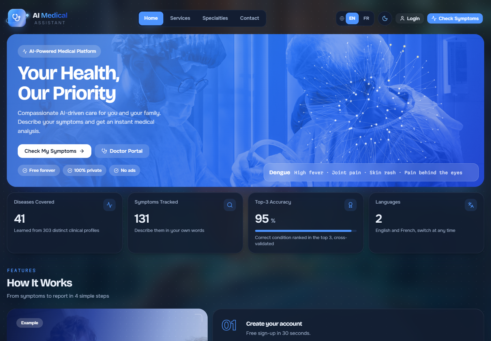

</div>

> [!WARNING]
> **This is an educational project, not a medical device.** Its results are hints to discuss with a
> doctor, never a diagnosis. In an emergency, call your local emergency number (15 / 112 in France).

## Contents

- [Highlights](#highlights)
- [Screenshots](#screenshots)
- [How the AI works](#how-the-ai-works)
- [Architecture](#architecture)
- [Getting started](#getting-started)
- [Deployment](#deployment)
- [Doctor verification](#doctor-verification)
- [Project structure](#project-structure)
- [Testing](#testing)
- [Security and privacy](#security-and-privacy)
- [Roadmap](#roadmap)

## Highlights

**For patients**
- Describe symptoms **in free text** ("j'ai mal à la gorge et je tousse depuis 3 jours") or pick them from 131 symptoms; negations such as "no fever" are understood.
- Get the **top 5 conditions** with calibrated probabilities, an **urgency level**, the **specialist** to see, and **follow-up questions** that would sharpen the result.
- See **why**: every symptom's push toward or away from the top prediction.
- **Red-flag rules** (chest pain + breathlessness, stiff neck + fever, …) raise urgency regardless of the model.
- Download a bilingual **PDF report**, chat with the **AI assistant** about a result, and follow your history in a **3D health timeline**.
- A complete **profile**: photo, blood type, height/weight with BMI, allergies, treatments, emergency contact.

**For doctors**
- Review patient analyses, add comments, validate or correct the AI's top condition.
- Doctor accounts are **verified**: identity card + medical diploma + licence number (RPPS), approved by an administrator before any doctor access.

**For administrators**
- Platform statistics, user and role management, model retraining, disease database, and the **doctor verification queue**.

**Everywhere**
- English / French, dark / light theme, full-screen photo design with 3D (three.js) visuals, keyboard-accessible custom controls.

## Screenshots

<table>
  <tr>
    <td width="50%">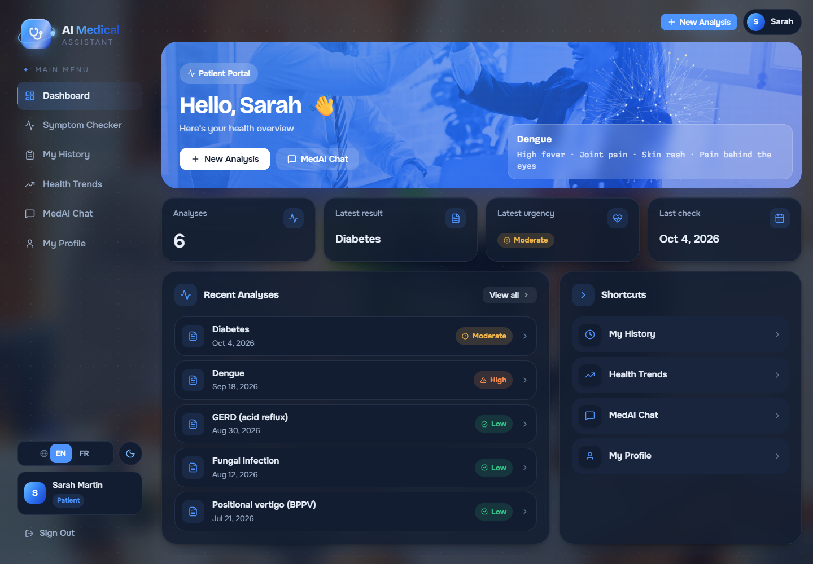<br /><sub><b>Patient dashboard</b>: latest result, urgency and shortcuts</sub></td>
    <td width="50%">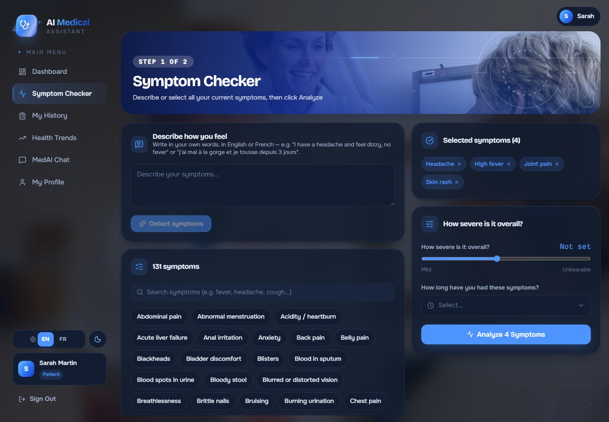<br /><sub><b>Symptom checker</b>: free text or 131 searchable symptoms</sub></td>
  </tr>
  <tr>
    <td>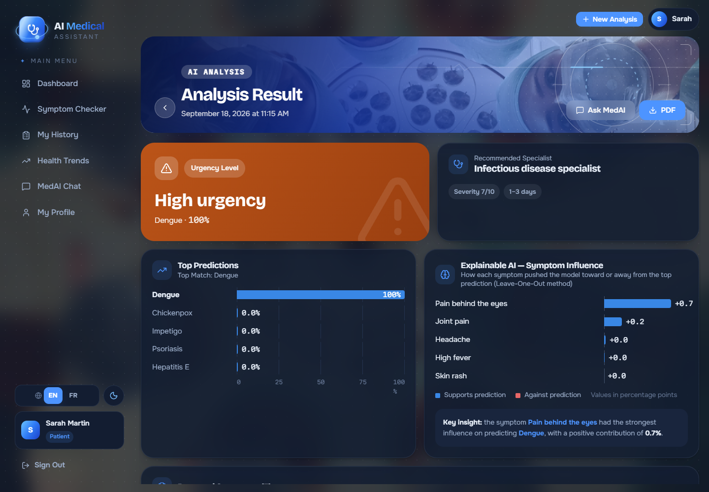<br /><sub><b>Result</b>: urgency, specialist, top-5 probabilities and per-symptom influence</sub></td>
    <td>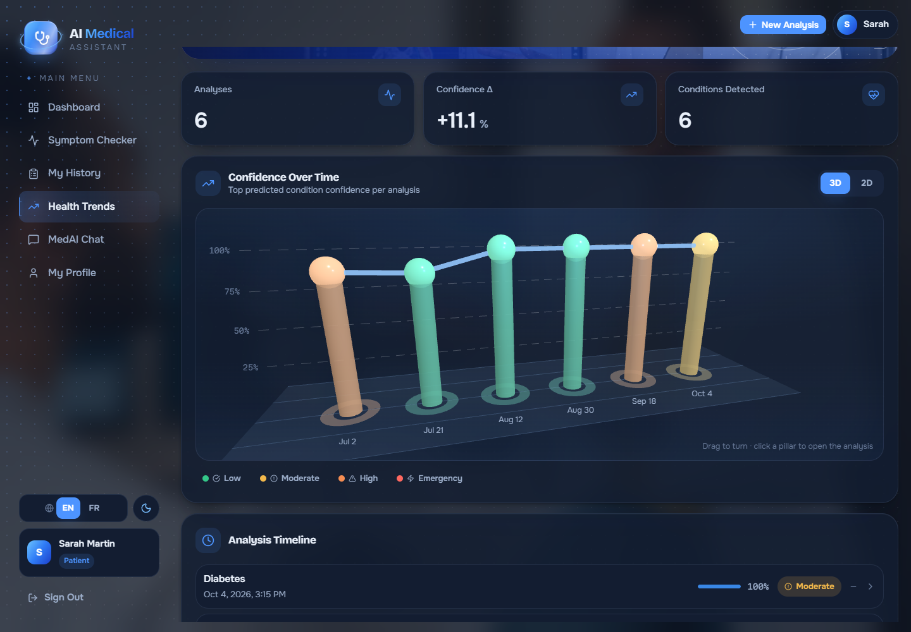<br /><sub><b>Health trends in 3D</b>: one pillar per analysis, colored by urgency (2D view available)</sub></td>
  </tr>
  <tr>
    <td>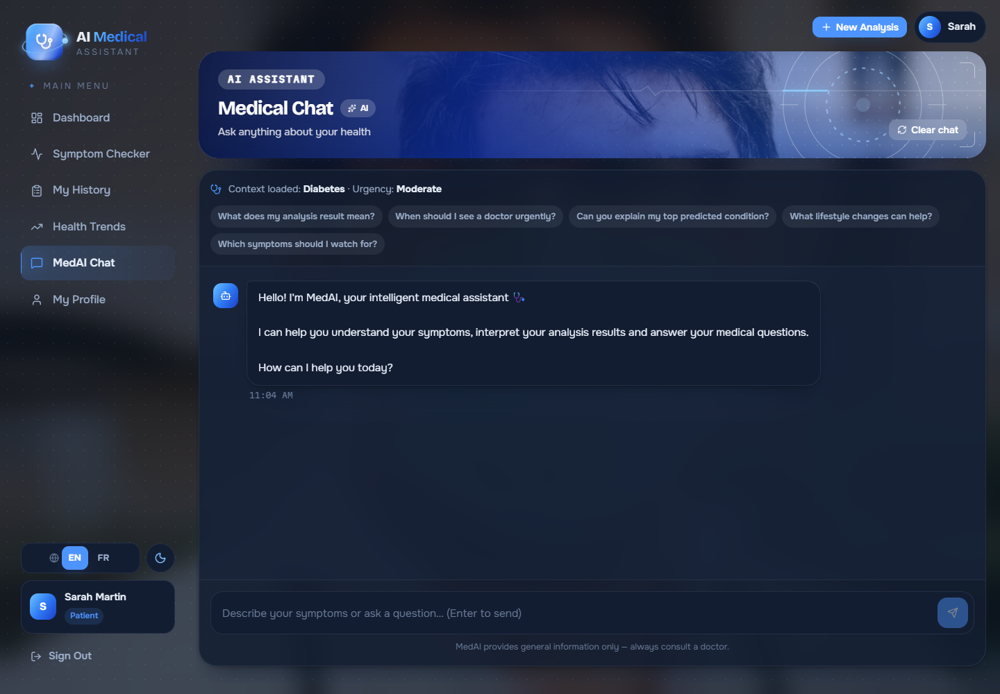<br /><sub><b>AI chat</b>: answers grounded in your latest analysis, with an offline fallback</sub></td>
    <td>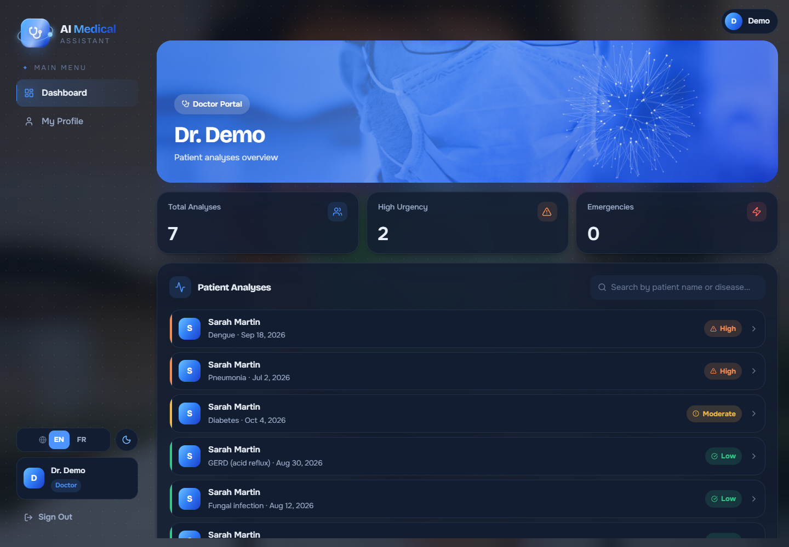<br /><sub><b>Doctor dashboard</b>: patient analyses sorted by urgency</sub></td>
  </tr>
  <tr>
    <td>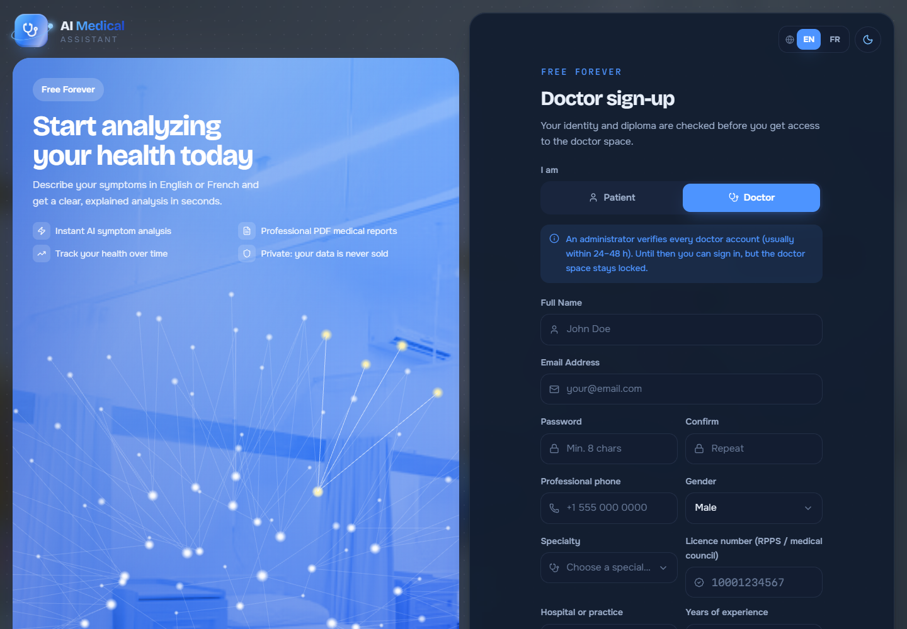<br /><sub><b>Doctor sign-up</b>: licence number, identity card and diploma required</sub></td>
    <td>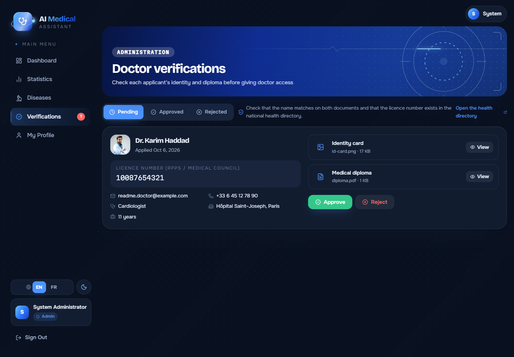<br /><sub><b>Admin verification</b>: check the documents, then approve or reject with a reason</sub></td>
  </tr>
  <tr>
    <td>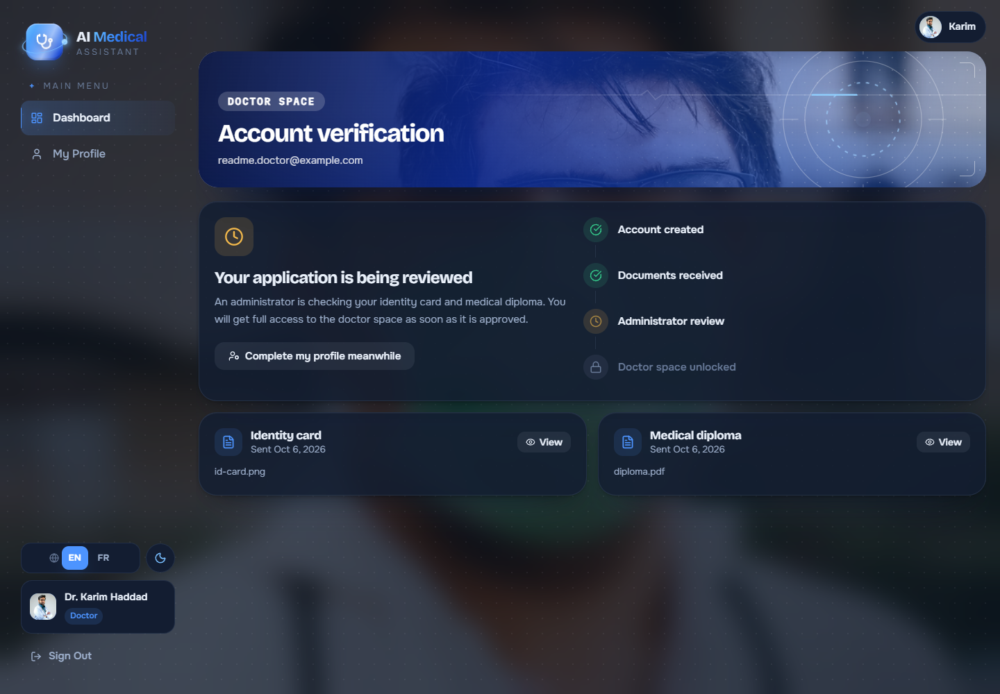<br /><sub><b>Pending doctor</b>: no doctor access until the account is verified</sub></td>
    <td>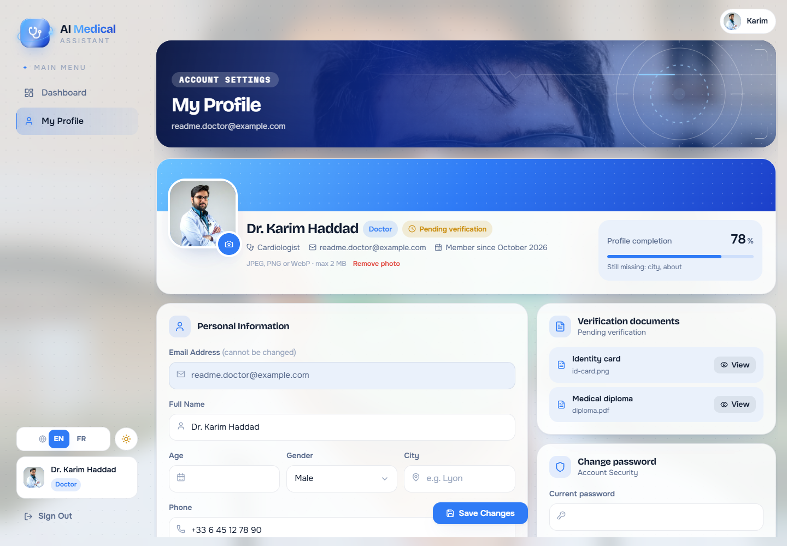<br /><sub><b>Profile</b> (light theme): photo, completion meter, professional details</sub></td>
  </tr>
</table>

## How the AI works

The model is trained on the public Kaggle dataset
[*Disease Prediction Using Machine Learning*](https://www.kaggle.com/datasets/kaushil268/disease-prediction-using-machine-learning)
(4,920 rows, 132 symptoms, 41 diseases). The raw file repeats the same symptom profiles many times,
so scores computed on it are inflated. The training pipeline (`ml/src/trainer.py`) is built to be honest about that:

| Step | What it does |
|---|---|
| Deduplication | 4,920 rows → **303 distinct clinical profiles**, so no profile is in both train and test |
| Realistic testing | Patients rarely report every symptom: models are tested on **partial symptom lists** |
| Model selection | Logistic regression vs. XGBoost, **5-fold cross-validation** |
| Calibration | Temperature scaling, so "80 %" really means about 80 % |
| Explanation | Leave-one-out: how much each reported symptom moves the top prediction |
| Follow-up questions | The unreported symptoms with the highest **information gain** |
| Safety | Red-flag rules and urgency thresholds that do not depend on the model |

**Selected model: logistic regression**, cross-validated on partial symptom lists:

| Top-1 accuracy | Top-3 accuracy | Macro F1 | Calibration error (ECE) |
|:---:|:---:|:---:|:---:|
| **87.3 %** | **95.4 %** | **0.876** | **0.020** |

Free text is read by a bilingual rule-based parser (synonyms, negations, contractions). When an AI
API key is configured, a language model reads the text and powers the chat; without one, everything
keeps working with the offline fallbacks.

## Architecture

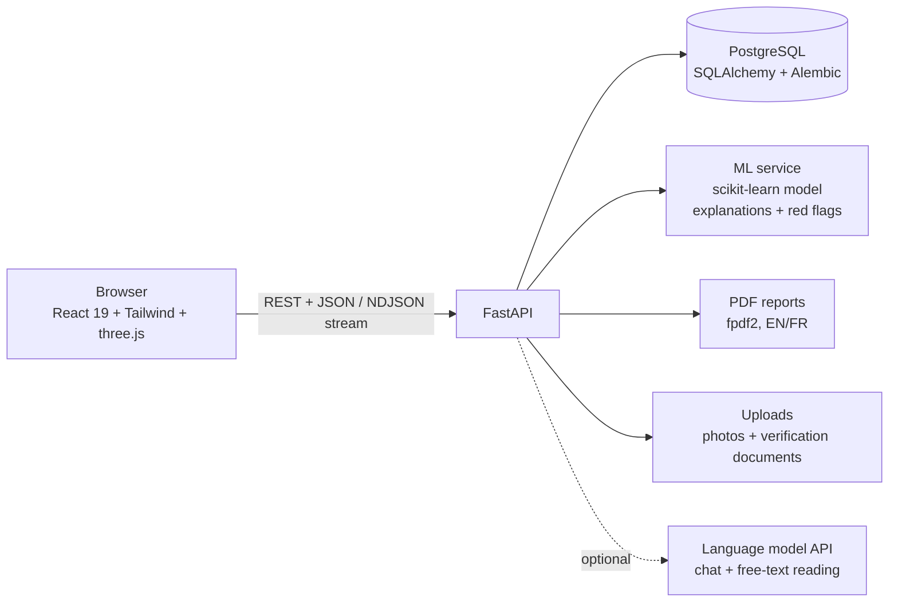

| Layer | Stack |
|---|---|
| Frontend | React 19, React Router 7, Tailwind CSS, three.js, i18next, lucide icons |
| Backend | FastAPI, SQLAlchemy 2, Alembic, Pydantic 2, JWT auth |
| Machine learning | scikit-learn, XGBoost (compared), NumPy |
| Data | PostgreSQL 16 |
| Delivery | Docker Compose (PostgreSQL + API + nginx serving the React build) |

## Getting started

### 1. Get the dataset

Download `Training.csv` from the [Kaggle dataset](https://www.kaggle.com/datasets/kaushil268/disease-prediction-using-machine-learning)
and save it as `ml/data/processed/training_data.csv`.

### 2a. Run with Docker (recommended)

```bash
echo "POSTGRES_PASSWORD=choose-a-password" > .env
cp .env.example backend/.env          # then set SECRET_KEY (and optionally an AI API key)
python -m ml.src.trainer              # trains the model into ml/models/saved/ (needs the backend requirements, see 2b)
docker compose up --build
```

Open <http://localhost:3000>. The database is migrated and demo accounts are created automatically.

### 2b. Run locally

```bash
# Backend (Python 3.13)
cd backend
python -m venv .venv && .venv\Scripts\activate      # macOS/Linux: source .venv/bin/activate
pip install -r requirements.txt
cp ../.env.example .env                              # set DATABASE_URL and SECRET_KEY
cd .. && python -m ml.src.trainer && cd backend      # train the model once
alembic upgrade head
python -m app.utils.create_admin                     # demo accounts
uvicorn main:app --reload --port 8000

# Frontend (Node 20+), in a second terminal
cd frontend
npm install
npm start                                            # http://localhost:3000
```

API documentation: <http://localhost:8000/api/docs>

### Demo accounts

| Role | Email | Password |
|---|---|---|
| Patient | `patient@medai.com` | `Patient@1234` |
| Doctor (verified) | `doctor@medai.com` | `Doctor@1234` |
| Admin | `admin@medai.com` | `Admin@1234` |

> These are for local development. In production (`ENVIRONMENT=production`) only your own administrator is created, from `ADMIN_EMAIL` / `ADMIN_PASSWORD`; the demo doctor never exists, and the optional demo patient is protected against changes.

## Deployment

The app deploys for free on **Render** (website + API, HTTPS included) with a **Neon** PostgreSQL database, in about 15 minutes: a [`render.yaml`](render.yaml) blueprint creates both services in one step. Follow **[DEPLOY.md](DEPLOY.md)**.

## Doctor verification

Anyone can sign up as a patient, but nobody becomes a doctor just by signing up.

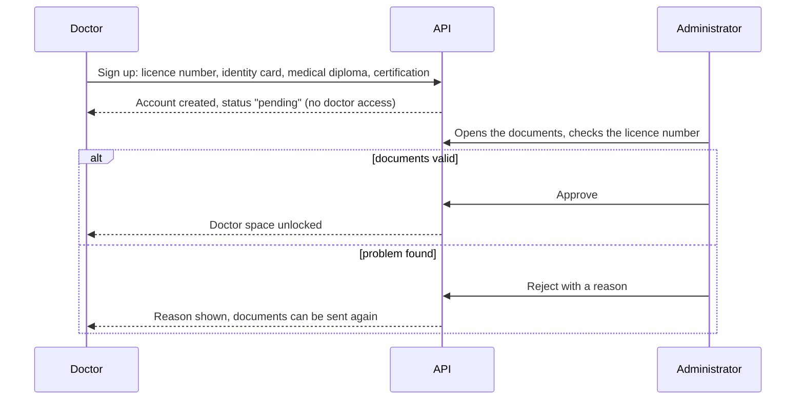

## Project structure

```
├── backend/
│   ├── app/
│   │   ├── api/routes/      # auth, users, analysis, reports, chat, doctor, admin
│   │   ├── models/          # SQLAlchemy models
│   │   ├── schemas/         # Pydantic schemas (validation)
│   │   ├── services/        # ML, chat, PDF, uploads, users
│   │   └── utils/           # demo account seeding
│   ├── alembic/             # database migrations
│   └── tests/               # pytest suite
├── frontend/
│   └── src/
│       ├── pages/           # patient, doctor, admin, auth, profile
│       ├── components/      # layout, charts, 3D scenes, UI kit
│       └── i18n/            # English / French translations + medical labels
├── ml/
│   └── src/                 # dataset, trainer, predictor, explainer, text parser
└── docker/                  # Dockerfiles, nginx, entrypoint
```

## Testing

```bash
cd backend
pytest
```

124 tests cover the API, the ML pipeline, the text parser, PDF reports, the chat fallbacks,
translations, profiles, uploads, the doctor verification rules and the production safety checks.

## Security and privacy

- Passwords are hashed with bcrypt; sessions use short-lived JWTs (30 minutes by default).
- Doctor access requires an administrator-verified account, and is checked on the server.
- Uploads are checked by their real content (not their file name), limited in size and stored under random names.
- Identity documents are only served to their owner and to administrators; profile photos are stripped of camera/GPS metadata.
- Uploaded files live in the database, never in a public folder; secrets (`.env` files) are never committed.
- In production the API refuses to start with a default secret key, and debug mode is forced off.

## Roadmap

- Move the frontend from Create React App to Vite and restore the frontend test suite
- Continuous integration (tests on every push)
- Rate limiting on the API
- Email notifications for doctor verification decisions

## Author

Built by **[Motez HM](https://github.com/HMotez)**.
